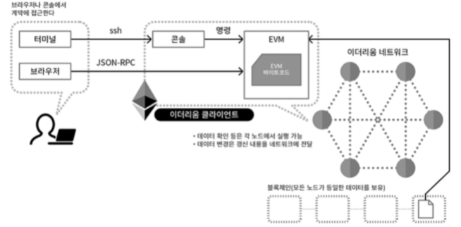

# Ethereum Concepts

## Smart Contract

### 변조 불가능성

* 배포된 스마트 컨트랙트는 변조 불가능 하다. 배포하기 전에 철저한 테스트를 거쳐야 한다.
* 변조 불가능한 장부는 각 tx를 누가, 언제, 어떤 내용으로 실행했는지에 대한 추적이 가능하다.
* 변조 불가능한 장부는 탈중앙화된 노드 간에 신뢰를 구축해준다.

### Solidity 

* 정적 타입 언어 (statically typed): 컴파일 시 변수의 타입이 결정되어 에러를 잡을 수 있다.
* 읽기 전용 함수를 정의할 수 있다. 이 함수는 원장에 기록을 남기지 않는다.
* 상태(state)를 변경하는 명령어들은 다음과 같다.
  1. state variable 에 쓰기
  2. event 발생
  3. 또다른 contract 생성
  4. `selfdestruct` 사용
  5. 호출(call)을 이용한 Ether 정송
  6. `view` 또는 `pure` 키워드가 명시되지 않은 함수 호출
  7. low-level call 사용
  8. 특정 opcode 가 포함도니 line assembly 사용 

### 이더리움 스마트 컨트랙트 동작방식의 이해

[출처1](https://www.opentutorials.org/course/2869/19273)
[출처2](https://blog.daum.net/liberalis/13222487)



- 이더리움과 소통하기 위해서는 EVM 에 명령어를 호출해야되는데 방법은
  1. ssh 를 통해 이더리움 클라이언트 콘솔에 연결하는 경우
  2. JSON-RPC 를 통해 EVM 에 직접 전달하는 방식이 있다.
- 스마트 컨트랙트가 배포되면 블락체인에 포함되고, 이는 블락체인 네트워크 상의 모든 노드들이 동일한 스마트 컨트랙트 코드를 가지고 있는 것.
- 따라서 각 노드의 EVM에서 스마트 컨트랙트 코드를 실행할 수 있다.

geth를 이용한 솔리디티 컨트랙트 활용

1. 이더리움 네트워크 연결
`geth attach rpc:http://localhost:8545`

2. 소스코드 컴파일 (EVM 바이트 코드 생성)
`sourceCompiled=eth.compile.solidity(source)`
- 0x6060604052341561000f57600080fd5b60405161046d38038061046d83398101604052808051909101905060....

3. 바이트코드로부터 ABI 취득
`contractAbiDefinition=sourceCompiled['/tmp/geth-compile-solidity025162961:HelloWorld'].info.abiDefinition`

4. ABI 로부터 컨트랙트 객체 생성 (컨트랙트 주소 생성 전)
`sourceCompiledContract= eth.contract(contractAbiDefinition)`

5. 계정 잠금 해제
`personal.unlockAccount(eth.accounts[0],"bompapa"))`

6. 컨트랙트 배포
`_greeting="Hello, World!"`
`contract=sourceCompiledContract.new(_greeting, {from:eth.accounts[0], data:sourceCompiled['/tmp/geth-compile-solidity025162961:HelloWorld'].code, gas:'4700000'})`
- 생성자에 매개변수 입력
- **5.** 에서 생성한 객체의 인스턴스를 만드는 격
- 트랜잭션 해쉬 생성
- `address: "0x6f9c338bb987f1baf619697784c9457b9afa119c"`

7. 채굴
`contract`
- `address` 부분을 살펴보면, undefined에서 주소가 변경되는 것을 확인. 이것이 채굴된 것을 의미한다.

8. 트랜잭션 해쉬로 내용을 확인할 수 있다.

```
{
  blockHash: "0x2691dcfbd09febcd6d60537386974ba2147ef2ada4e7693a541000442aa5d91d",
  blockNumber: 1230,
  from: "0x9751574414138b22986eb80ce2713cd2f5508c5c",
  gas: 4700000,
  gasPrice: 20000000000,
  hash: "0x99ddfd763478ce7a0d328fbc67f3c10fec377efa18a8e9c41f61321feb836cd1",
  input: "0x6060604052341561000f57600080fd5b60405161046d38038061046d8339...000000000",
  nonce: 1,
  r: "0x7e7bbc34563f0a6e7d5113344eaea0761d4edf815d41ac752d3cb33b4f65fb43",
  s: "0x61a968fcab4935d0f17b67a5274c31ed2a499ccbc5aa605a9080192a940834e9",
  to: null,
  transactionIndex: 0,
  v: "0x1b",
  value: 0
}
```
- `input`: 소스코드를 컴파일한 바이트코드
- 컨트랙트를 배포하는 트랜잭션에는 수신자가 없다

9. block 정보로 실제 gas 사용량을 확인할 수 있다.
`eth.getBlock(1230)`

10. 컨트랙트 함수 호출
`contract.say.call()`: read
`contract.setGreeting.sendTransaction("Hello, Ethereum!",{from:eth.accounts[0], gas:1000000})`: write

11. ABI 와 address 를 이용해 기존에 등록한 컨트랙트를 받아올 수 있다.
`contract2= eth.contract(contractAbiDefinition).at("0x6f9c338bb987f1baf619697784c9457b9afa119c")`
- contract와 contract2는 변수를 공유한다.

## Accounts

* 이더리움에는 두 종류의 어카운트가 있다: EOA, CA
* 주소의 크기는 20 bytes (160 bits)
* EOA, CA 모두 이더 밸런스르 가질 수 있다.
  * `address`, `balance`라는 implicit 속성을 가진다.
  * 명시적으로 속성이 없어도 `address(this).balance` 처럼 사용할 수 있다.

### EOA (Externally Owned Accounts)

* CA에 메시지를 보냄으로써 함수를 호출한다.
* 메시지는 `msg.sender`와 `msg.value`라는 implied 속성을 가지고 있다.
* 메시지로 전달한 value 는 CA의 balance에 더해진다.
  
### CA (Contract Accounts)

* 금액을 전송받기 위해서는 함수에 `payable` 수정자를 선언해야 한다.
* 개인키가 존재하지 않아서 tx를 실행할 수 없다. Tx의 목적지가 CA인 경우에만 실행 된다.
* `address`를 통해 EOA를 가진 사용자들이 CA를 호출할 수 있다.

## Ethereum Stack

### Level 1: EVM (Ethereum Virtual Machine)

* 이더리움 스마트 컨트랙트의 실행환경

## Nonce

[출처](https://medium.com/swlh/ethereum-series-understanding-nonce-3858194b39bf)

```
{
  "nonce" : 'how many confirmed transactions this account has sent previously?',
 "gasPrice" : 'price of gas (in wei) the originator is willing to pay for this transaction',
 "to": 'recipient of this transaction(either smart contract or EOA)',
 "value": 'how much ether this transaction pays',
 "data": 'any binary data payload',
 "v,r,s": 'three components of ECDSA signature of originating account holder'
}
```

Nonce란?
- 어떤 주소(EOA)가 기존에 몇 번의 트랜잭션을 성공시켰는지 0 부터 카운팅하는 번호다.
- 블록체인에 저장되지 않고 dynamic 하게 연산을 하여 얻는 정보다.
- nonece 0 과 nonce 1 의 트랜잭션을 보냈을 때 채굴자는 0 부터 채굴하여 순서를 지킬 수 있도록 한다.
- 또한, 트랜잭션은 nonce 값을 포함한 트랜잭션 바이트코드를 생성하기 때문에, 같은 nonce 에 대해 채굴을 저지하여 바이트코드만으로 계속 전송하는 replay 공격을 막을 수 있다.

문제 요소
1. 지갑이 내 EOA의 nonce 를 관리해주는데, 2 군데서 같은 nonce 로 트랜잭션을 보낼 수가 있다.
2. 1000 건의 트랜잭션을 보내야하는 경우 nonce 값을 증가시켜주면서 트랜잭션을 보내기 위해 추가적인 관리가 필요하다.
3. nonce 값에 gap 이 발생한 경우 트랜잭션은 mempool 에 pending 된 상태로 유지된다.

## Transaction

[출처](https://medium.com/@codetractio/inside-an-ethereum-transaction-fa94ffca912f)

- 컨트랙트 어드레스와 트랜잭션도 sender의 nonce 를 포함하기 때문에 unique 하다.