# Truffle을 이용한 이더리움 개발 튜토리얼

[Truffle 공식 사이트](https://trufflesuite.com/tutorial/index.html)에 제시된 튜토리얼을 따라 실습한다.

## Set up

### nodejs

```console
# curl
sudo apt-get update
sudo apt-get install curl

# nvm latest LTS 버젼 설치
curl -o- https://raw.githubusercontent.com/nvm-sh/nvm/v0.39.1/install.sh | bash
# restart terminal
nvm --version

# nodejs latest LTS 버젼 설치
nvm ls-remote --lts # nodejs latest LTS 버젼 확인 (v16.13.2)
nvm install 16.13.2
nvm ls
node -v
```
- [nvm LTS](https://github.com/nvm-sh/nvm#long-term-support) 최신버젼 출처
- `nvm ls-remote` 명령어 실행시 `N/A` 결과가 나올 경우: [stackoverflow](https://stackoverflow.com/questions/26476744/nvm-ls-remote-command-results-in-n-a)

### truffle

```console
npm install -g truffle
truffle version 
# Truffle v5.4.29 (core: 5.4.29)
# Solidity v0.5.16 (solc-js)
# Node v16.13.2
# Web3.js v1.5.3
```
- `npm ls -g` 명령어로 설치된 패키지들을 조회해보면 solidity나 web3 라이브러리는 설치되어있지 않다.
다만 truffle 에서 사용하기 위해 내부적으로 라이브러리가 포함된 것으로 추정된다.
truffle 튜토리얼 중에는 `solidity ^0.5.0`버젼을 활용하는 것으로 보아 지금은 새로 설치하지 않고 
추후에 스마트 컨트랙트를 개발할 시점에 최신 버젼의 solidity를 설치하여 dependency 에 추가해서 사용하겠다.

<details>
<summary>solidity 업그레이드 관련 노트</summary>
<div markdown="1">

1. Path에 등록된 truffle 명령어 설치 위치 확인

```console
which truffle # /home/gus/.nvm/versions/node/v16.13.2/bin/truffle
```

2. 설치 가능한 solidity 버젼 확인

```console
npm view solc versions
```

3. solc 패키지 설치

```console
npm install -g solc@0.8.11
```

4. truffle 패키지 dependency 수정

```console
vi /home/gus/.nvm/versions/node/v16.13.2/lib/node_modules/truffle/package.json
```

```console
...
"bundleDependencies": false,
  "dependencies": {
    ...
    "solc": "^0.4.15"
  },
```

- [stackexchange](https://ethereum.stackexchange.com/questions/17551/how-to-upgrade-solidity-compiler-in-truffle/47244)

</div>
</details>

### Ganache

필자는 nodejs 및 truffle 라이브러리는 가상머신 위의 우분투 서버 설치했고, [Ganache](https://trufflesuite.com/ganache/)는 호스트 윈도우에 설치했다.

## Tutorial

### 1. 프로젝트 생성 

```console
mkdir ~/pet-shop-tutorial
cd ~/pet-shop-tutorial
truffle unbox pet-shop
```
- 튜토리얼을 위해 제공되는 pet-shop 프로젝트를 `unbox` 명령어로 받아온다.
- 새로운 프로젝트를 생성하고 싶다면 `truffle init`명령어를 실행한다.

### 2. 디렉토리 구조

- `contracts/`: 솔리티디 코드 목록 (중요한 컨트랙트: `Migrations.sol`)
- `migrations/`: 트러플은 스마트 컨트랙트 배포를 위해 migration system을 사용한다. 변경 사항을 기록하는 특수한 스마트 컨트랙트라고 생각하면 된다.
- `test/`: 자바스크립트와 솔리디티 테스트 
- `truffle-config.js`: 트러플 설정 파일

### 3. 스마트 컨트랙트 작성

```js
// Adoption.sol
pragma solidity ^0.5.0;

contract Adoption {
  address[16] public adopters;

  // Adopting a pet
  function adopt(uint petId) public returns (uint) {
    require(petId >= 0 && petId <= 15);

    adopters[petId] = msg.sender;

    return petId;
  }

  // Retrieving the adopters
  function getAdopters() public view returns (address[16] memory) {
    return adopters;
  }

}
```

- `pragma`: 컴파일러만 참고하는 정보
- `^0.5.0`: `0.5.0`버젼 이상
- `;`: 문장 종료 syntax
- **statically-typed language**: 솔리디티는 타입을 선언해야하는 언어이다. 컴파일시 타입 체크.
  - 함수 파라미터와 리턴 값 모두 타입이 선언되어야 한다.
- `address`: 어카운트, 또는 스마트 컨트랙트의 주소를 의미하는 솔리디티만의 타입 (20 bytes).
- array: fixed 또는 variable 길이 배열 선언 가능
- `public`: 자동으로 **getter** 함수가 선언된다. Array의 경우 key를 이용해 하나의 값만 리턴 받을 수 있다.
- `require()`: 조건을 확인하는 함수
- `msg.sender`: 해당 함수를 호출한 EOA 또는 CA 주소
- `getAdopters()`: Array의 getter 함수는 1개의 값만 리턴할 수 있기 때문에, 전체 array를 리턴하는 함수를 만들었다.
- `memory`:
  - `returns (address[16] memory)`: 변수의 저장 위치를 반환한다.
  - `address[16] memory adopters = adoption.getAdopters();`: 값을 컨트랙트 저장소에 저장하지 않고 메모리에만 들고있도록 선언한다. (테스트코드의 함수 내 선언된 변수)
- `view`: 함수가 컨트랙트의 상태(state)를 바꾸지 않을 것을 명시하는 키워드.
  - `getter` 함수는 기본적으로 `view`로 선언된다.

### 4. Compilation

솔리디티 코드는 bytecode로 컴파일해야 EVM 에서 실행할 수 있다.

```console
truffle compile
```
- 프로젝트의 root 디렉토리에서 실행

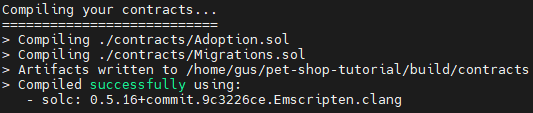

### 4. Migration

**Migration**이란 어플리케이션 컨트랙트의 상태를 바꾸는 *배포 스크립트*다. 첫 번째 마이그레이션에서는 코드를 배포하고, 이후의 마이그레이션에서는
데이터를 수정하거나 새로운 컨트랙트로 대체하게 된다.

- `migrations/1_initial_migration.js`: `Migration.sol` 컨트랙트를 배포하고, 이후에 중복되는 마이그레이션을 방지한다.

`Adoption.sol` 컨트랙트를 위한 마이그레이션 파일을 생성한다.

```js
// 2_deploy_contracts.js
var Adoption = artifacts.require("Adoption");

module.exports = function(deployer) {
  deployer.deploy(Adoption);
};
```

### 5. Ganache 시작

기본 설정으로 윈도우에 설치한 Ganache를 실행한다.

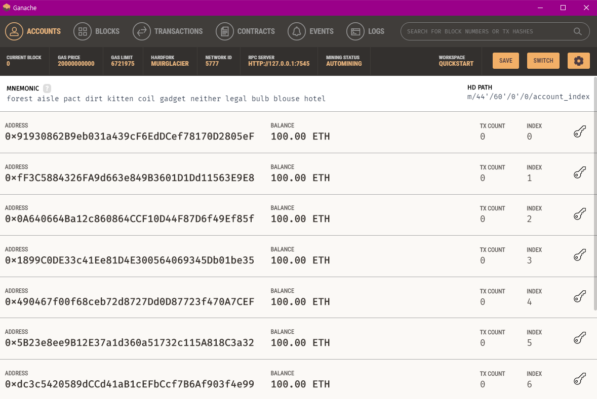

리눅스 서버(게스트)에서 윈도우(호스트)의 가나쉬에 붙기 위해서는 가나쉬 설정을 변경해줘야 한다.

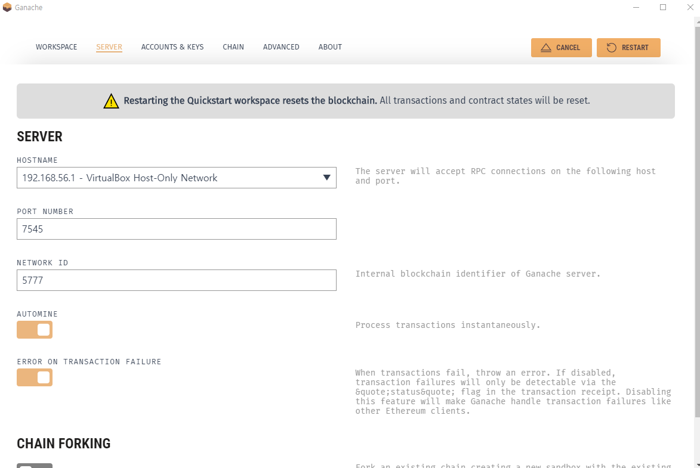

서버 목록에서 호스트 전용 네트워크로 설정하고 가나쉬를 재시작 한다.

Pet-shop 프로젝트 폴더 루트에 있는 `truffle-config.js` 파일에서도 아래와 같이 host 를 설정해준다.

```
module.exports = {
  // See <http://truffleframework.com/docs/advanced/configuration>
  // for more about customizing your Truffle configuration!
  networks: {
    development: {
      host: "192.168.56.1",
      port: 7545,
      network_id: "*" // Match any network id
    },
    develop: {
      port: 8545
    }
  }
};
```

### 6. Migrate

```console
truffle migrate
```

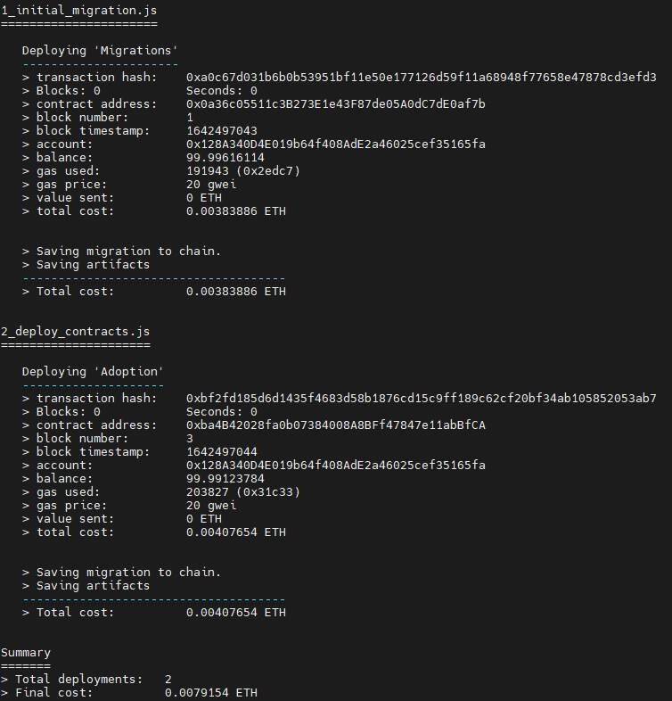 

작성한 2개의 Migration이 성공한 모습

### 7. Solidity 로 테스트 코드 작성

```js
// TestAdoption.sol
pragma solidity ^0.5.0;

import "truffle/Assert.sol";
import "truffle/DeployedAddresses.sol";
import "../contracts/Adoption.sol";

contract TestAdoption {
  // The address of the adoption contract to be tested
  Adoption adoption = Adoption(DeployedAddresses.Adoption());

  // The id of the pet that will be used for testing
  uint expectedPetId = 8;

  // The expected owner of adopted pet is this contract
  address expectedAdopter = address(this);

  // Testing the adopt() function
  function testUserCanAdoptPet() public {
    uint returnedId = adoption.adopt(expectedPetId);

    Assert.equal(returnedId, expectedPetId, "Adoption of the expected pet should match what is returned.");
  }

  // Testing retrieval of all pet owners
  function testGetAdopterAddressByPetIdInArray() public {
    // Store adopters in memory rather than contract's storage
    address[16] memory adopters = adoption.getAdopters();

    Assert.equal(adopters[expectedPetId], expectedAdopter, "Owner of the expected pet should be this contract");
  }
}
```

- `Assert.sol`: 테스트에서 사용할 수 있는 다양한 assertion 코드
  - `=`, `!=`, `is null`, `pass`, `fail`
  - [Assert.sol](https://github.com/trufflesuite/truffle/blob/master/packages/resolver/solidity/Assert.sol)
- `DeployedAddresses.sol`: 테스트할 때 트러플은 블록체인상에 테스트할 새로운 컨트랙트 인스턴스를 배포한다. DeployedAddresses 컨트랙트는 이런 배포된 컨트랙트의 주소를 받아온다.
- `truffle/*.sol`: truffle 디렉토리가 아닌 global Truffle 파일을 명시함
- `this`: 컨트랙트 내에서 사용할 수 있는 현재 컨트랙트의 주소
- `memory`: adopters 정보를 컨트랙트 저장소가 아닌 메모리에 저장한다.

```
truffle test
``` 

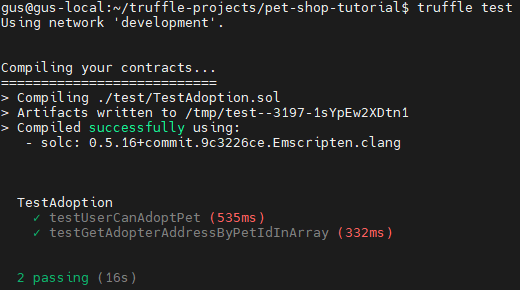

- Ganache 에서는 테스트를 위해 총 19개의 새로운 tx가 생성됐다.

### 8. Create user interface

Pet-shop 프로젝트의 프론트엔드 코드는 `src/` 폴더에 작성되어있다. 이더리움 블록체인과 연동하기 위한 **web3 라이브러리** 를 활용하여 javascript 코딩을 실습한다. 

```js
// src/js/app.js
App = {
  web3Provider: null,
  contracts: {},

  init: async function() {
    // Load pets.
    $.getJSON('../pets.json', function(data) {
      var petsRow = $('#petsRow');
      var petTemplate = $('#petTemplate');

      for (i = 0; i < data.length; i ++) {
        petTemplate.find('.panel-title').text(data[i].name);
        petTemplate.find('img').attr('src', data[i].picture);
        petTemplate.find('.pet-breed').text(data[i].breed);
        petTemplate.find('.pet-age').text(data[i].age);
        petTemplate.find('.pet-location').text(data[i].location);
        petTemplate.find('.btn-adopt').attr('data-id', data[i].id);

        petsRow.append(petTemplate.html());
      }
    });

    return await App.initWeb3();
  },

  initWeb3: async function() {
    // Modern dapp browsers...
    if (window.ethereum) {
      App.web3Provider = window.ethereum;
      try{
        // Request account access
        await window.ethereum.request({ method: "eth_requestAccounts" });
      } catch (error) {
        // User denied account access...
        console.error("User denied account access")
      }
    }
    // Legacy dapp browsers...
    else if (window.web3) {
      App.web3Provider = window.web3.currentProvider;
    }
    // If no injected web3 instance is detected, fall back to Ganache
    else {
      App.web3Provider = new Web3.providers.HttpProvider('http://192.168.56.1:7545');
    }
    web3 = new Web3(App.web3Provider);

    return App.initContract();
  },

  initContract: function() {
    $.getJSON('Adoption.json', function(data) {
      // Get the necessary contract artifact file and instantiate it with @truffle/contract
      var AdoptionArtifact = data;
      App.contracts.Adoption = TruffleContract(AdoptionArtifact);

      // Set the provider for our contract
      App.contracts.Adoption.setProvider(App.web3Provider);

      // User our contract to retrieve and mark the adopted pets
      return App.markAdopted();
    });

    return App.bindEvents();
  },

  bindEvents: function() {
    $(document).on('click', '.btn-adopt', App.handleAdopt);
  },

  markAdopted: function() {
    var adoptionInstance;

    App.contracts.Adoption.deployed().then(function(instance) {
      adoptionInstance = instance;

      return adoptionInstance.getAdopters.call();
    }).then(function(adopters) {
      for (i = 0; i < adopters.length; i++) {
        if (adopters[i] !== '0x0000000000000000000000000000000000000000') {
          $('.panel-pet').eq(i).find('button').text('Success').attr('disabled', true);
        }
      }
    }).catch(function(err) {
      console.log(err.message);
    });
  },

  handleAdopt: function(event) {
    event.preventDefault();

    var petId = parseInt($(event.target).data('id'));

    var adoptionInstance;

    web3.eth.getAccounts(function(error, accounts) {
      if (error) {
        console.log(error);
      }

      var account = accounts[0];

      App.contracts.Adoption.deployed().then(function(instance) {
        adoptionInstance = instance;

        // Execute adopt as a transaction by sending account
        return adoptionInstance.adopt(petId, {from: account});
      }).then(function(result) {
        return App.markAdopted();
      }).catch(function(err) {
        console.log(err.message);
      });
    });
  }

};

$(function() {
  $(window).load(function() {
    App.init();
  });
});
```
- `initWeb3` 함수
  - 최신 MetaMask 나 최신 브라우져를 사용하는 경우라면, `window` 객체에 `ethererum` 프로바이더가 주입되어있다. `"eth_requestAccounts"` 리퀘스트를 통해 계정과 연결 가능하다.
  - Mist 또는 이전 버젼의 MetaMask의 경우 `web3` 프로바이더를 조회한다.
  - 그 마저도 없다면 로컬 프로바이더를 사용해 web3 객체를 생성한다. 이는 보안상 권장하지 않는다.
- `initContract` 함수
  - Adoption.json 파일은 `/build/contracts/`에 있다.
  - `@truffle/contract` 라이브러리는 migration된 정보를 공유하기 때문에 컨트랙트의 주소를 수동으로 수정할 필요가 없다.
  - **Artifact**는 컨트랙트에 대한 정보이다.
    - 배포된 주소
    - Application Binary Interface (ABI): 컨트랙트와 소통할 수 있는 JavaScript 객체. 변수, 함수, 파라미터가 포함되어있다.
  - `TruffleContrct()`: 소통하고자 하는 컨트랙트의 인스턴스를 생성한다.
  - 생성한 인스턴스에 web3 프로바이더를 설정한다.
  - `markAdopted()` 
- `markAdopted` 함수
  - `deployed()`된 Adoption 컨트랙트에 접근하고 해당 인스턴스의 `getAdopters()` 함수를 호출한다.
  - `adoptionInstance`: 는 스마트컨트랙트 호출 후에도 사용하기 위해서 바깥에서 선언했다.
  - `call()`: 블록체인에서 full tx를 보내지 않고 데이터를 읽어올 수 있다. (gas free)
  - `'0x0000000000000000000000000000000000000000'`: 이더리움은 address 타입에 대해 empty address로 초기화한다.
- `handleAdopt` 함수
  - `adopt(petId, {from: account})`: 이번엔 `call()` 대신 tx을 전송한다. 이는 `from` 주소를 요구하고 비용이 발생한다. (gas)
    - **gas**: 연산 또는 저장 비용
  - tx 의 결과는 tx 객체이다. 

### 9. 브라우져를 통한 dapp과의 연동

브라우져에 설치된 메타마스크에 Custom RPC 를 추가한다.

1. 네트워크 추가 

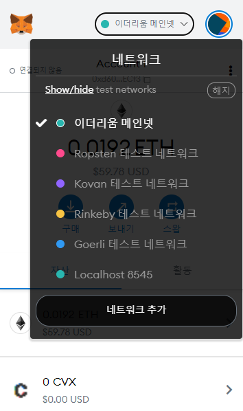

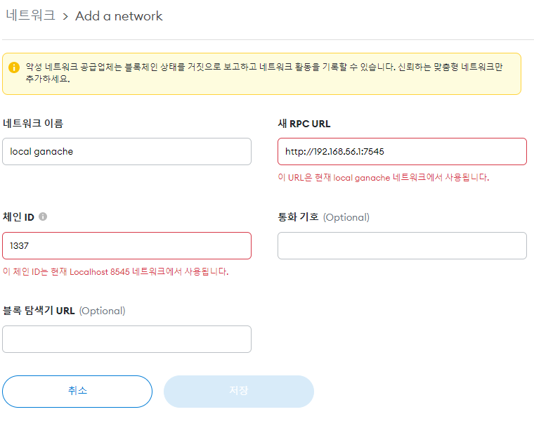

2. 기존에 메타마스크를 사용하고 있었다면, 가나쉬에서 발급된 테스트용 계정을 메타마스크에 추가한다.

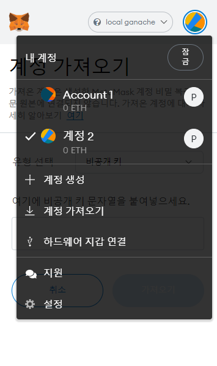

  - 생성한 local ganache 네트워크 인것을 확인하고 우측 상단의 계정 이미지를 눌러 **계정 가져오기**를 클릭한다.

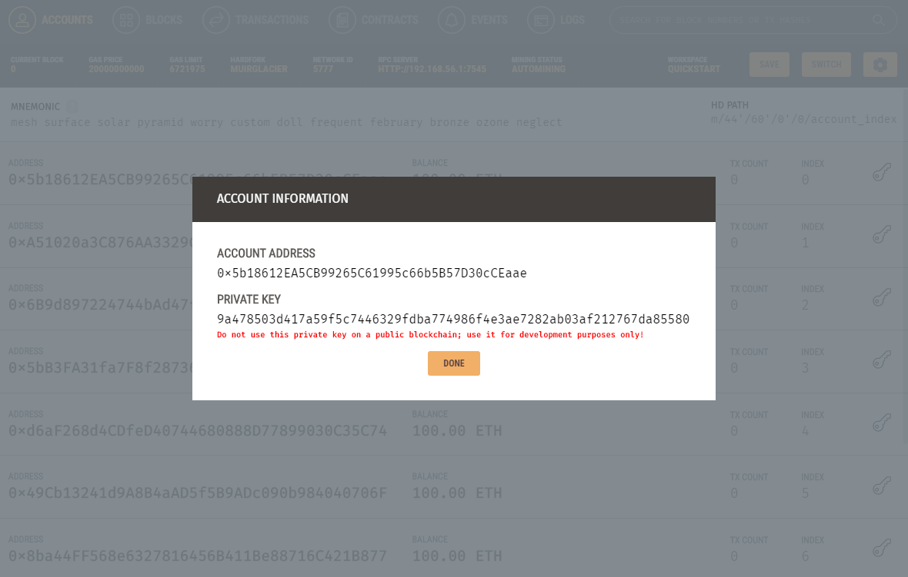

  - ganache 에서 계정 하나의 가장 오른쪽에 있는 열쇠 버튼을 눌러 private 를 복사하여 메타마스크에 입력한다.

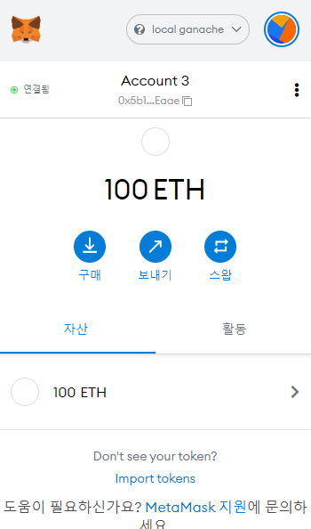

  - 메타마스크에서 100 ETH 가 생성된 계정이 연동되는 것을 확인한다.


### 10. 로컬 웹 서버 (Pet-shop) 구동

```json
// bs-config.json
{
  "server": {
    "baseDir": ["./src", "./build/contracts"]
  }
}
```
- `src` 폴더와 `contracts` 폴더를 베이스 디렉토리에 추가한다.

```
npm run dev
```
- `package.json` 에 명시된 dev 명령어를 실행한다.

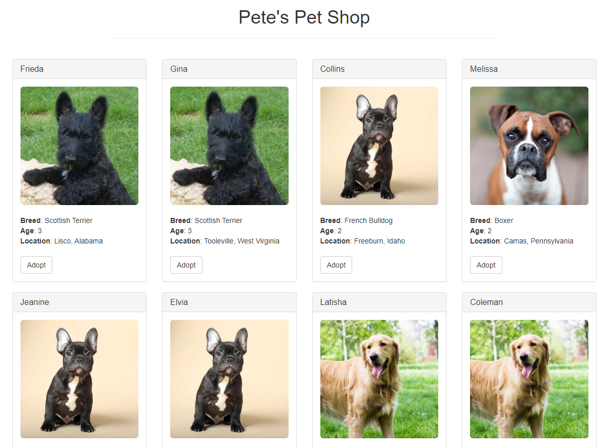

- Pet-shop 사이트 접속한 모습

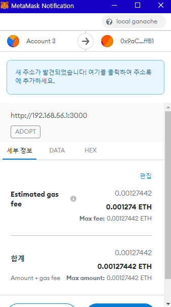

- Adopt 버튼을 통해 MetaMask 서명 창

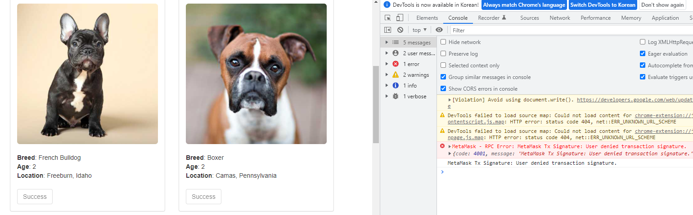

- Adopt 트랜잭션 성공 후 사이트에서 'Success' 으로 변경된 모습
- 크롬 개발자 도구를 활용하면 사이트에서 web3 소통하는 로그를 참고할 수 있다.
  - 현재 보이는 창에서 나타난 오류는 필자가 1차 Adopt 시도를 취소한 결과다.

> 먄약 "gas fee exceeds account balance"와 같은 에러가 나온다면 아래 과정을 단계별로 수행했는지 확인해본다.

1. Ganache 네트워크 구동
2. `truffle migrate` 명령어로 네트워크에 스마트 컨트랙트 배포
3. Pet-shop 사이트 접속 (필요하면 캐시 비우기 및 강제 새로고침)
4. 메타마스크에서 ganache 네트워크 및 ganache 에 존재하는 어카운트의 *연결됨* 상태 확인

## 마치며

이더리움 개발에 대한 입문으로 Truffle 에서 제공한 튜토리얼을 실행해보았다.

- Solidity 코드 개발
- Solidity 테스트 코드 개발
- Ganache 테스트 네트워크 실행
- Ganache 네트워크에 Solidity 코드 컴파일 및 배포
- Web3 코드 개발
- Pet-shop 서버 구동
- Pet-shop 웹사이트에서 메타마스크 연동
- 메타마스크 트랜잭션 발생

다음으로 해볼 것을 정리해보면

1. Web3j 로 Java 서버에서 web3 코드 개발
2. Ganache 에서 Contracts 정보를 확인해보기 위해서는 truffle-config.json 을 인식시킬 수 있다.
  - 다만 필자는 truffle 은 리눅스 서버, 그리고 Ganache 는 윈도우에서 실행해서 인식이 잘 안됐다.
  - GUI를 포기하고 ganache-cli 를 써야한다면 시도해보겠다.