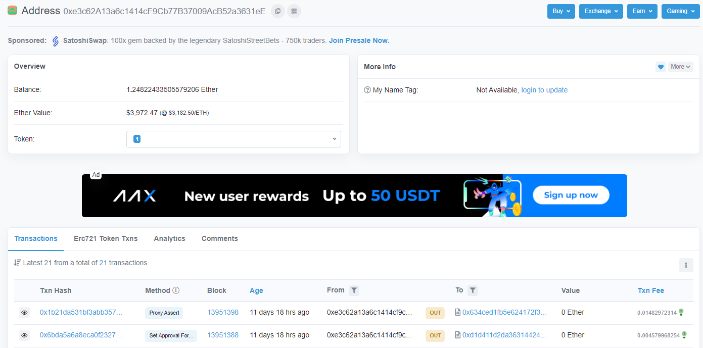

# Etherscan 분석

## 개요

이더리움 퍼블릿 네트워크를 사용한다면 필연적으로 [Etherscan](https://etherscan.io/)에 접속하게 된다. 
CA, EOA, TX 등 다양한 조회 조건으로 관련된 정보들을 보기 편하게 제공한다. 가령 내가 소유하고 있는 NFT의 과거 트랜잭션 목록을 조회해볼 수 있다.

개발자로서 이더리움 네트워크와 이더스캔 관련 다음과 같은 질문들이 떠올라 검색을 통해 정리해보았다.

## Address를 기반으로 Tx 목록을 불러올 수 있는가?

이더스캔에서 Address 조회를 하면 **Transactions** 와 **Erc721 Token Txns** 목록을 조회해볼 수 있는 메뉴가 있다. 
전자는 조회한 Address의 FT(Erc20 또는 Ether)토큰과 관련된 트랜잭션 목록을 보여주며
후자는 같은 주소의 NFT(Erc721)토큰과 관련된 트랜잭션 목록을 보여준다.

그렇다면, 이더리움 블록체인 네트워크에서 Address를 입력하면 관련된 트랜잭션 목록을 반환해주는 API가 있는걸까?

[Stackoverflow 게시글](https://stackoverflow.com/questions/36291117/how-to-get-ethereum-transaction-list-by-address)에 따르면 그런 기능은 없다.
[오픈 소스](https://github.com/Adamant-im/ETH-transactions-storage)를 이용해 Indexer라는 도구로 이더리움 노드에 접근하여 모든 트랜잭션을 수집하고 분류해야 한다.
대안으로 퍼블릭 네트워크(메인넷, 테스트넷)의 모든 트랜잭션을 수집하고 분석해주는 Ethersca n의 API를 활용할 수 있다.

TODO

스택오버플로우의 게시글을 더 정확히 이해하기 위해 직접 분석해봐야할 것들:

* 이더리움 노드 API 분석
* Erc20, Erc721 API 분석

