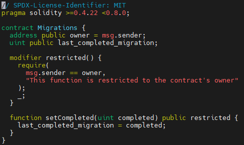

# Vim Solidity Extension

1. `Vundle` 다운로드

Vim 편집기에서 다양한 플로그인을 다운받기 위해서는 Vundle 플러그인 매니저를 사용해야 한다.

```
git clone https://github.com/VundleVim/Vundle.vim.git ~/.vim/bundle/Vundle.vim
```

2. `vim-solidity` 다운로드

solidity용 플러그인을 내려받는다.

```
git clone https://github.com/tomlion/vim-solidity.git ~/.vim/bundle/vim-solidity
```

2. `~/.vimrc` 설정

[Vundle 레포지토리](https://github.com/VundleVim/Vundle.Vim#quick-start)를 참고하여 Vundle 설정을 위해 `~/.vimrc`파일에 입력해야 하는 내용을 복사한다.

```
vi ~/.vimrc
```

```
set nocompatible              " be iMproved, required
filetype off                  " required

" set the runtime path to include Vundle and initialize
set rtp+=~/.vim/bundle/Vundle.vim
call vundle#begin()

" let Vundle manage Vundle, required
Plugin 'VundleVim/Vundle.vim'
Plugin 'tomlion/vim-solidity'

call vundle#end()            " required
filetype plugin indent on    " required
```
- 추가하고 싶은 플러그인은 `call vundle#begin()`와 `call vundle#end()`사이에 추가해야 한다.
- 기본적으로 Vundle 플러그인을 포함해야 한다.
- 내려받은 solidity 플러그인도 명시했다.
- 저장하고 닫는다.

3. Plugin 설치

```
vim
:PluginInstall
```
- `vim`명령어로 편집기를 열고, escape (esc 누른) 상태에서 `:PluginInstall` 명령어를 입력하여 플러그인들을 전부 설치한다.

4. 플러그인 적용 확인



Pet-shop 트러플 샘플 프로젝트에서 제공하는 `Migrations.sol` 파일을 vim 편집기로 오픈한 모습.

